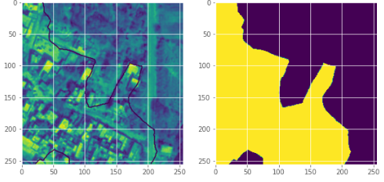
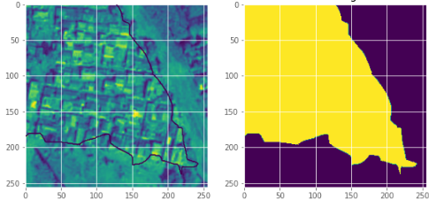
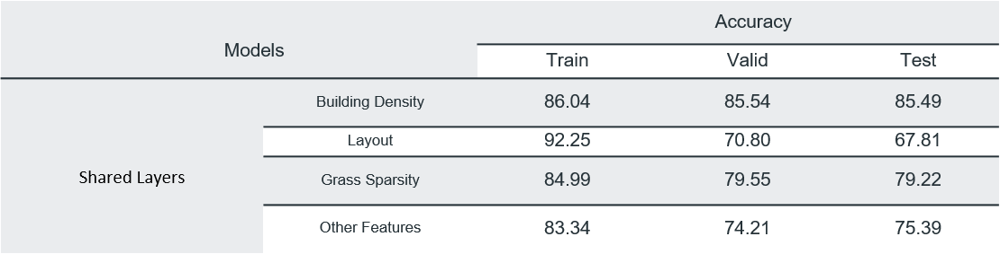
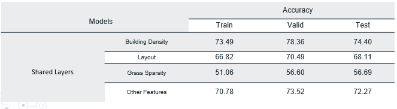
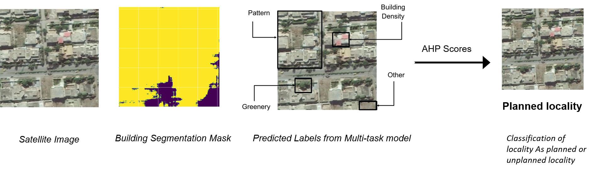

# MSDS19016_Project_DLSpring2020
This repository contains code and results for the Course Project by Deep Learning Spring 2020 course offered at Information Technology University, Lahore, Pakistan. This repository is only for learning purposes and is not intended to be used for commercial purposes.
http://im.itu.edu.pk/deep-learning-spring-2020/

The complete
# Dataset
For this research project we have used two different datasets.
- We have used Village Finder dataset compiled by this paper.Which can be found [here](https://drive.google.com/drive/folders/1REaNUpaD6Dm64v1FEDop20LgJtXvorXz?usp=sharing)

- To train our multi task learning model we had compiled a separate data set containing satellite images of different cities of pakistan.We than manually labeled them for differnet features.Dataset along with its labels can be find [here](https://drive.google.com/drive/folders/1krdvIv_RydPIDkCCNyJoFycnCDAidp-K?usp=sharing)

# Models
All the Trained models for each tasks can be found [here](https://drive.google.com/file/d/1--uh8mXfwMKAH2pL24_yw6RMAC8h-fmu/view?usp=sharing)

### Phase 1
In this phase we filtered out images containing built structures using deep learning technique called semantic segmentation.

#### Building Segmentation
Semantic segmentation is process of labelling each pixel of an image belonging to similar class. Village Finder dataset was fed to U-net architecture for training purpose. In testing phase, Pakistan’s satellite images data is passed to this model which outputs only those images where buildings are present

  **Results**  

  **Some of the predictions of the model are**  

### Phase 2
Now that we had images containing built structures, we needed to learn different features from these images that could help us classify images as planned or unplanned localities. Our first approach towards this problem was multi-label classification. To overcome the short-comings of this method we tried training task specific models for predicting each label such as building density, greenery sparsity, etc. Later we tried Multi-task learning since all the predicted labels were correlated.

#### Multi-label classification
Since we had to predict multiple labels corresponding to each image we opted for multi-label classification of images. Using the images (obtained through building segmentation model) as input we trained mutiple models having different architectures. For every model we had used sigmoid with binary cross entropy as loss function. Results obtained for different models are given below:  
**Results**  

#### Task Specific Models
To ensure that we don't miss any label we tried using task specific models. Since our predicted labels could be divided into 4 tasks
- Prediction of building density
- Prediction of greenery sparsity
- Prediction of layout
- Prediction of (Exposed Soil, Large buildings grass and trees) 

We designed separate models for each task. This allowed us to ensure that we don't miss out on any important labels. All these task specific models had same architecture as that of simple multi-label model except for the dense layers. We freezed the convolutional layers of the multi-label model and appended dense layers to it. This made a single task specific model. Apart from dense layer another differentiating factor between these task oriented models is that we treated 3 out of 4 tasks as multi-class problem and 1 task(Prediction of Exposed Soil, Large buildings grass and trees) as multi-label problem. Lastly, softmax with binary cross entropy was used for multi-class problems and sigmoid with categorical cross entropy was used for multi-label problem. Results obtained for different experiments are shown below:  

**Results**  

#### Multi-task Learning
In order to train our task specific models more efficiently we used multi task learning[5]. This method allows different models to share weights with each other and allows the models to generalize better. We used trained VGG16 as backbone of the multi-task architecture and the sub-networks all had similar architecture except for the last dense layer of these subnets. In the last layer softmax with binary cross entropy was used for multi-class problems (prediction of building density, greenery sparsity and layout)  and sigmoid with categorical cross entropy was used for multi-label problem(Prediction of Exposed Soil, Large buildings grass and trees). Results obtained for different experiments are shown below:  

**Results**  

## The Overall Follow of prediction for a single image is as follows.

