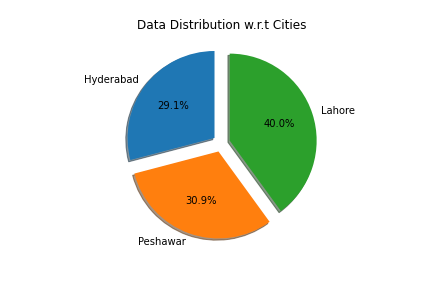
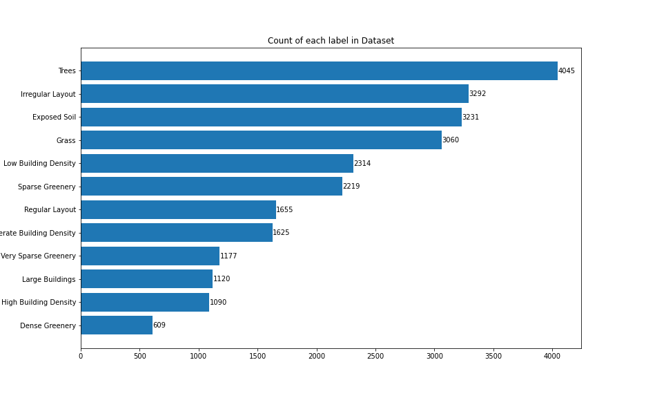
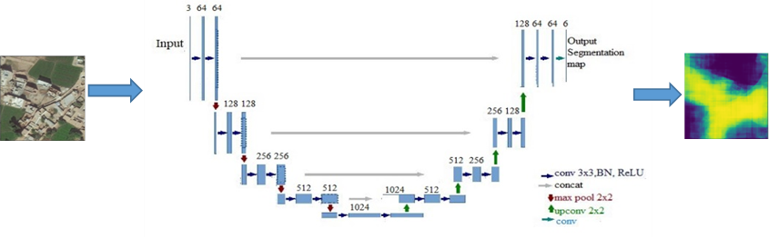
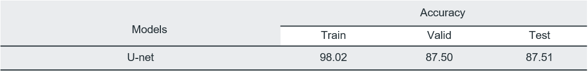
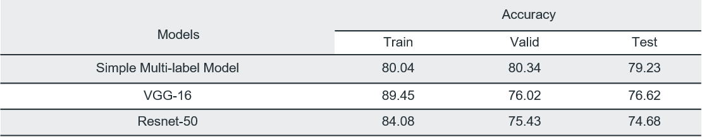
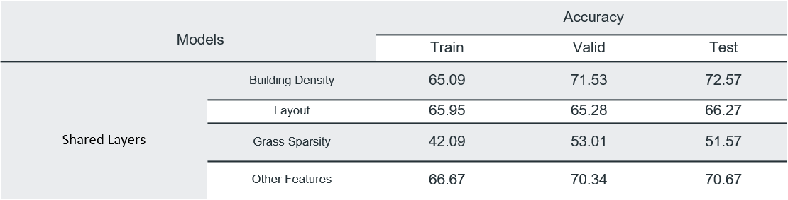

# MSDS19070_Project_DLSpring2020
This repository contains code and results for the Course Project by Deep Learning Spring 2020 course offered at Information Technology University, Lahore, Pakistan. This repository is only for learning purposes and is not intended to be used for commercial purposes.http://im.itu.edu.pk/deep-learning-spring-2020/

## Abstract
We attempted to address the problem of classifying planned/unplanned localities. Localities categorization could assist municipality in proper allocation of resources. However,  a variety of factors have to be incorporated for any such classification, which makes this a complex task. To tackle all such intricacies, we propose a deep learning approach for classifying different areas using satellite imagery. We propose a multi-task learning framework that learns variety of features from the satellite images and finds the one most effective for classifying planned or unplanned developments. For training and evaluation of our proposed method we have compiled a dataset containing labelled satellite images  of three geographically diverse cities of Pakistan. Our experimental results validate the proposed technique

## Overview
This blog post is going to be pretty long! Here’s an overview of the different sections. If you want to skip ahead, just click the section title to go there.

- [Introduction](#introduction)
- [Dataset](#dataset)
- [Methodology](#methodology)
- [Conclusion](#conclusion)

## Introduction
Majority of the urban applications: development of cities, urban planning, provisioning municipal services, and cadastral inspection requires detailed information and observation of an area. Generally, such information is collected by utilizing on ground authorities and volunteers. However, collecting all this information via on-ground forces is not feasible. Consequently, satellite imagery is being used for the purpose of ground information collection. Over the last decade deep neural networks have shown exceptional capability to learn complex patterns in digital data. These techniques can be applied for detecting different patterns and structures in satellite imagery and classify satellite images as planned or unplanned localities.

### The Problem
We attempted to address the problem of classifying planned/unplanned localities. Localities categorization could assist municipality in proper allocation of resources. However,  a variety of factors have to be incorporated for any such classification, which makes this a complex task.

### The Solution
We propose a deep learning approach for classifying different areas using Remote sensing data. We developed a multi-task learning architecture that learns variety of features from the satellite images and finds the one most effective for classifying planned or unplanned developments. Using these features we calculate planned locality index for each image by applying analytical hierarchical processing technique.

### Software and Hardware
We have mainly used Python, NumPy and Keras to implement our solution. All our experiments have been performed using Google's colaboratory service. To replicate these experiments successfully GPU based runtime of colaboratory is required.
  
## Dataset
For this research project we have used two different datasets. The first one is called Village Finder [1](). We used this dataset to train a model for building segmentation. To train our multi task learning model we had compiled a separate data set containing satellite images of different cities of pakistan.

### Village Finder
Village Finder Dataset contains 3566 images where each image is of 256 x 256 pixels. Corresponding to each image we have masked images that act as labels for building segments in that image. We used this dataset to train a model for building segmentation. This model is later utilized to extract images containing built structures during compilation of  our main dataset for this project.

### Pakistan Satellite Dataset
Due to the unavailability of any previous planned/unplanned localities dataset, we introduced our new dataset which contains high resolution satellite images of three major cities of Pakistan: Lahore, Peshawar and Hyderabad. Satellite images are downloaded using the Google Static Maps API, each with 256 x 256 pixels at zoom level 19, giving us a total of 140k satellite imagery. To only filter out the images containing buildings, we ultilized the building segmentation model trained on Village Finder dataset. The resulted images, which are filtered out from this step, are then tagged with multiple labels. For each image, we have three mandatory labels: layout, building and greenery density. Options for tagging building density are high building density (>80), moderate building density (50%-80%) and low building density (<50%). Similarly, greenery can be tagged out of dense greenery (>50%), sparse greenery (5-50%) and very sparse greenery (<5%). The layout of the images can be either regular or irregular. Additionally , we also have four optional labels including grass, trees, exposed soil and large buildings. We have approximately 5000 tagged images in this dataset. Following are some insights related to the dataset that depict the diversity of dataset to some extent.
  *Data Distribution* 

  *Labels Count* 

## Methodology
Our project is divided into three phases. In the first phase, semantic segmentation is incorporated, for building segmentation. The second phase of this project was dedicated towards finding important features that could help us classify localities as planned or unplanned developments. In the third phase we applied Analytical Hirearchical Processing

### Phase 1
In this phase we filtered out images containing built structures using deep learning technique called semantic segmentation.

#### Building Segmentation
Semantic segmentation is process of labelling each pixel of an image belonging to similar class. Village Finder dataset was fed to U-net architecture for training purpose. In testing phase, Pakistan’s satellite images data is passed to this model which outputs only those images where building density is greater than 0.1%. U-net architecture[4], shown in figure below, consists of two parts: encoder and decoder. Encoder part consists of 3x3 convolutional layers and 2x2 max pooling layers. However, decoder part consists of 2x2 transposed 2d convolutions and 1x1 up convolutional layers. U-net gives the output image of the same size as of input image.  
**Model**  

  **Results**  

### Phase 2
Now that we had images containing built structures, we needed to learn different features from these images that could help us classify images as planned or unplanned localities. Our first approach towards this problem was multi-label classification. To overcome the short-comings of this method we tried training task specific models for predicting each label such as building density, greenery sparsity, etc. Later we tried Multi-task learning since all the predicted labels were correlated.

#### Multi-label classification
Since we had to predict multiple labels corresponding to each image we opted for multi-label classification of images. Using the images (obtained through building segmentation model) as input we trained mutiple models having different architectures. For every model we had used sigmoid with binary cross entropy as loss function. Results obtained for different models are given below:  
**Results**  

  Best results were obtained using our simple multi label model. Architecture diagram for simple multi label model is as follow:  
**Simple multi label Model**  

  Although the results were not bad, there was one issue with this approach. At times the model missed some important labels such as layout, building density etc.

#### Task Specific Models
To ensure that we don't miss any label we tried using task specific models. Since our predicted labels could be divided into 4 tasks
- Prediction of building density
- Prediction of greenery sparsity
- Prediction of layout
- Prediction of (Exposed Soil, Large buildings grass and trees) 

We designed separate models for each task. This allowed us to ensure that we don't miss out on any important labels. All these task specific models had same architecture as that of simple multi-label model except for the dense layers. We freezed the convolutional layers of the multi-label model and appended dense layers to it. This made a single task specific model. Apart from dense layer another differentiating factor between these task oriented models is that we treated 3 out of 4 tasks as multi-class problem and 1 task(Prediction of Exposed Soil, Large buildings grass and trees) as multi-label problem. Lastly, softmax with binary cross entropy was used for multi-class problems and sigmoid with categorical cross entropy was used for multi-label problem. Results obtained for different experiments are shown below:  

**Results**  

  Architecture diagram for task specific models is as follow:  

**Task Specific Model**  

  Since all the predicted labels were related to each other in one way or the other, hence, sharing the updated weights to train all the models simultaneously might improve the results.

#### Multi-task Learning
In order to train our task specific models more efficiently we used multi task learning[5]. This method allows different models to share weights with each other and allows the models to generalize better. We used trained VGG16 as backbone of the multi-task architecture and the sub-networks all had similar architecture except for the last dense layer of these subnets. In the last layer softmax with binary cross entropy was used for multi-class problems (prediction of building density, greenery sparsity and layout)  and sigmoid with categorical cross entropy was used for multi-label problem(Prediction of Exposed Soil, Large buildings grass and trees). Results obtained for different experiments are shown below:  

**Results**  

  Architecture diagram for task specific models is as follow:  

**Multi-task learning Model**  

## Analyical Hirearchical Processing
In the last phase of our project we calculated Planned Locality Index for each image. To convert our predicted labels for each task into an interpretable score depicting planned index of a locality we have applied Analytical Hierarchical Processing (AHP). AHP allows us to scale down the complexity of calculating planned index scores. It generates a single value that accommodates all the different features of the image such as buildings density, greenery sparsity, buildings layout etc. This way we reduce our high dimensional space to a scalar value. 
Each image in our training dataset had a label vector of length 12. To implement the AHP procedure we had to prepare 1-9 scale pair-wise comparison rubric. This rubric contained comparison between each label and based on this comparison we get scores corresponding to each label. These scores represent how much that label contributes towards the planned locality index calculated for an input image. Hence, AHP procedure helps us assign priorities for each label.  

  We  use  this  priorities  vector **p** and multiply it with the vector **l** containing the predicted labels of the image. This results in the planned locality index score for the subject image. Images with planned index score higher than **30** are considered Planned localities and other are tagged as unplanned localities.

## Conclusion
We tried to solve a challenging task of classification of planned and unplanned developments. Overlapping features of these localities makes the job at hand difficult. We have introduced a dataset capturing diverse geographical regions of Pakistan having different buildings density, greenery density, regular or irregular buildings layout and other minor features that could help,develop a generalized model to solve the classification problem at hand. Our final solution, multi-task learning using VGG-16 as backbone, allows us to capture features that are equally important for detection of different objects specific to planned /unplannedlocalities. These features are then optimized for specific object detections using the branching sub-nets. Using these branching sub-nets, we can identify areas having high building density, areas with regular buildings layout and patches with dense greenery. We can improve our results by utilizing a pixel level labelled dataset. A larger dataset would also give us room to train deep networks and achieve better accuracy. Furthermore, we can utilize the results generated from sub-nets and feed them to Analytic hierarchy process (AHP) to generate planned development index which would score a satellite image to be called a planned locality or unplanned locality. This approach could help us identify the most important features that contribute towards classification of a locality as planned or unplanned development. AHP finds the objects that maximizes the planned development index of an image

## References
1. Murtaza, Kashif, Sohaib Khan, and Nasir M. Rajpoot. "VillageFinder: Segmentation of Nucleated Villages in Satellite Imagery." In BMVC, pp. 1-11. 2009.
2. Iglovikov, Vladimir, and Alexey Shvets. "Ternausnet: U-net with vgg11 encoder pre-trained on imagenet for image segmentation." arXiv preprint arXiv:1801.05746 (2018).
3. Zhang, Yu, and Qiang Yang. "A survey on multi-task learning." arXiv preprint arXiv:1707.08114 (2017).

#### Team Members
[//]: contributor-faces

[//]: contributor-faces
